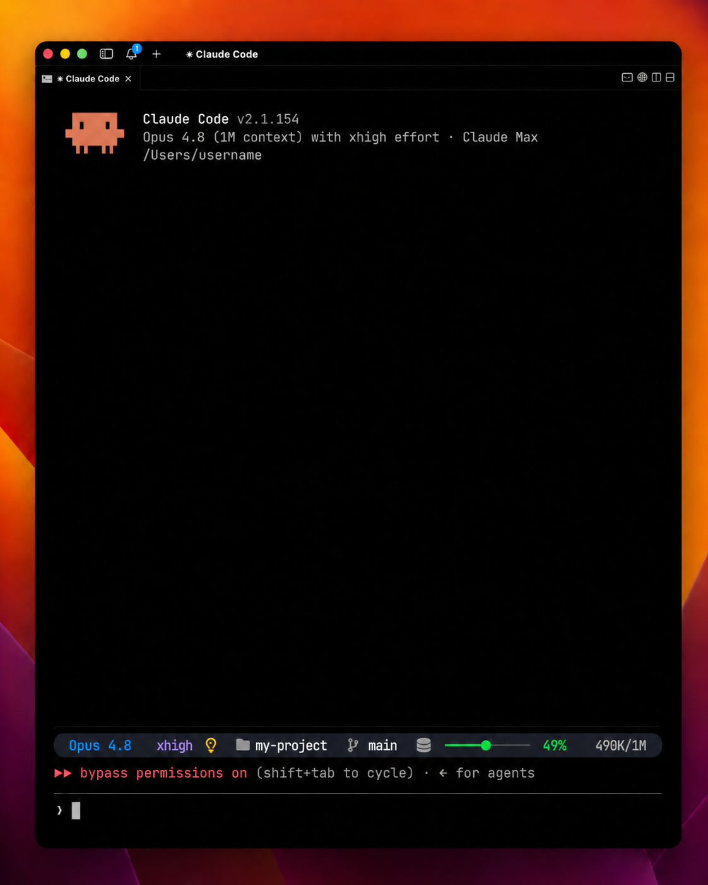

<div align="center">

# glint

### A liquid-glass status line for Claude Code

[](LICENSE)
[](https://www.zsh.org/)
[](https://docs.claude.com/en/docs/claude-code)
[](https://github.com/leonardocandiani/glint/pulls)

A liquid-glass status line for the Claude Code CLI. One rounded pill, floating on your terminal's dark background, with a background gradient painted cell by cell so the edges catch light and the center recedes into glass. It shows the model, effort, context pressure, and your git state at a glance, and renders in roughly 20ms with a single `jq` call and a single `git` call.



</div>

## Features

- 🪟 **Liquid-glass pill** with rounded Powerline caps and a per-character RGB gradient: bright rim light at the edges easing into a darker, cool-tinted body. No banding, no zone seams.
- 🧠 **Future-proof model name** read straight from `model.display_name`. Opus 4.8, 4.9, whatever ships next shows up on its own, no script edits.
- 📊 **Context bar that can track auto-compaction.** Set `CLAUDE_CODE_AUTO_COMPACT_WINDOW` and the bar measures against it, so the percentage shows how close you are to a compaction instead of the distant model ceiling. Falls back to the model's context size otherwise.
- 🎚️ **Thin slider bar** with a round knob marking the fill point. State color shifts with pressure: green under 50%, yellow at 50%, orange at 75%, red at 90%.
- 🎨 **Effort colored by level**: low gold, medium green, high blue, xhigh purple, max magenta.
- 💡 **Thinking lamp** (gold) when extended thinking is on, plus a **bolt** when fast mode is active.
- 🌿 **Git and worktree aware**: branch name, a dirty counter for uncommitted changes, and the worktree name when you're inside one.
- ⚡ **Built for speed**: one `jq` pass, one `git` pass, no render loops. Around 20ms per draw.

## Preview / Anatomy

The whole status line is a single pill. Reading left to right:

```
   Opus 4.8  xhigh  💡    my-project    main •3    ━━━━●───  62%  124K/200K
   └─ model  └─ effort  └─ thinking  └─ project  └─ branch + dirty  └─ context: bar, %, tokens
```

| Part | What it shows | Detail |
| --- | --- | --- |
| **Rounded caps** | The pill's left and right ends | Powerline glyphs `U+E0B6` / `U+E0B4`, tinted to match the bright edge of the gradient so the pill reads as one coherent surface |
| **Model** | `Opus 4.8`, `Sonnet 4.6`, etc. | From `model.display_name`, with a parse of `model.id` as fallback. Rendered in Apple blue, the single accent color |
| **Effort** | `low` / `medium` / `high` / `xhigh` / `max` | Colored by level so you can read your reasoning budget without squinting |
| **Thinking lamp** | 💡 glyph | Shown in gold only when thinking is enabled |
| **Fast bolt** | bolt glyph | Shown when fast mode is on |
| **Project** | Folder, worktree root, or session name | Falls back to the current directory's basename |
| **Git** | Branch (or worktree name) + dirty count | A `•N` amber counter appears when there are uncommitted changes |
| **Context bar** | Slider with a knob | `U+2501` filled track, `U+2500` rail, `U+25CF` knob, all in the current state color |
| **Context %** | Percent of the context budget used | Auto-compact window if you set one, otherwise the model's context size. Bold, in the state color, with the exact used/total token count right after |

## Install

One-liner:

```sh
curl -fsSL https://raw.githubusercontent.com/leonardocandiani/glint/main/install.sh | zsh
```

The installer copies the script into `~/.claude/`, backs up anything it replaces, and wires up `statusLine` in your `settings.json`. It does not touch any of your other settings.

### Manual steps

1. Copy `statusline-command.sh` into your Claude Code config directory:

   ```sh
   cp statusline-command.sh ~/.claude/statusline-command.sh
   chmod +x ~/.claude/statusline-command.sh
   ```

2. Point `statusLine` at it in `~/.claude/settings.json`:

   ```json
   {
     "statusLine": {
       "type": "command",
       "command": "~/.claude/statusline-command.sh"
     }
   }
   ```

3. Restart Claude Code (or start a new session). The pill shows up at the bottom.

That's it. By default the context bar measures against the model's reported context size. If you'd rather it track how close you are to an auto-compaction, opt in (see Configuration).

## Configuration

Tuning lives in two places: one env var for behavior, and a handful of constants at the top of the script for looks.

| What | Where | Default | Notes |
| --- | --- | --- | --- |
| `CLAUDE_CODE_AUTO_COMPACT_WINDOW` | `env` in `settings.json` (or shell) | unset → model context size | **Opt-in.** The token window the bar measures against. Set it to your real auto-compact threshold to see how close you are to a compaction. Heads up: this is a genuine Claude Code setting that also controls when auto-compact actually fires, not just this display, so only set it if you want that behavior |
| `EDGE_PEAK` | top of `statusline-command.sh` | `680` | How much the pill's edges brighten, on a `0..1000` scale. Higher means a stronger rim light; the center always sits at the base color |
| `GLASS_BR` / `GLASS_BG` / `GLASS_BB` | top of script | `50 / 50 / 58` | RGB of the glass body (the dark center) |
| `GLASS_SR` / `GLASS_SG` / `GLASS_SB` | top of script | `96 / 100 / 118` | RGB of the lit edges (the cool blue-gray rim) |
| State colors | `STATE` block in script | green / yellow / orange / red | The context thresholds and their colors. Edit the RGB triples to retint the bar |
| `C_ACCENT` | palette block | Apple blue | The model accent color |
| Effort colors | `case "$effort"` block | gold / green / blue / purple / magenta | One color per effort level |
| Caps | `CAP_L` / `CAP_R` | `U+E0B6` / `U+E0B4` | Swap to empty strings if your font lacks the Powerline extras |

## How it works

**Char-by-char gradient.** Instead of coloring fixed zones, the script breaks the rendered line into cells (one foreground color and one character each), then rebuilds it cell by cell with a background color interpolated along a continuous light curve. The curve peaks at both ends (rim light, where glass catches light) and dips in the middle (the translucent body), with a cool blue tint throughout. Because it's continuous, there are no dark "islands" between segments, the pill looks like one molded surface. This depends on counting code points rather than bytes, so the script forces `LANG`/`LC_ALL` to UTF-8 and enables `setopt multibyte` up top.

**Context vs auto-compact.** In a long session the number that matters often isn't how far you are from the model's full context limit, it's how close you are to the next auto-compaction. The script sums input, output, cache-creation, and cache-read tokens, then divides by `CLAUDE_CODE_AUTO_COMPACT_WINDOW` when you've set one (falling back to the model's reported context size otherwise). The bar fills and the color escalates as you approach the limit.

**`model.display_name`.** The model label comes from the payload's `model.display_name`, which Claude Code already formats and versions for you. New model versions appear automatically. If that field is ever empty, the script parses `model.id` as a fallback.

## Requirements

- **zsh** (the script is written in zsh and uses zsh-specific features)
- **jq** for the single JSON parse
- A **Nerd Font** in your terminal, for the pill caps and the glyphs
- A terminal with **24-bit truecolor** support, for the gradient

## Customization

Every visual knob lives in clearly labeled constants at the top of `statusline-command.sh`:

- **Make the pill brighter or flatter**: raise or lower `EDGE_PEAK`.
- **Change the glass tone**: edit the `GLASS_B*` (center) and `GLASS_S*` (edge) RGB triples. Push them warmer, cooler, lighter, darker.
- **Retint the context states**: edit the RGB in the `STATE` block, or move the `90` / `75` / `50` thresholds.
- **Recolor effort or the accent**: edit the effort `case` block and `C_ACCENT`.
- **Drop the rounded caps**: if your font doesn't carry the Powerline extras, set `CAP_L` and `CAP_R` to empty strings and the pill becomes a clean rectangle.
- **Resize the bar**: change `bar_total` to widen or narrow the slider.

## Credits

Built by **Leonardo Candiani** ([@leonardocandiani](https://github.com/leonardocandiani)).

## License

[MIT](LICENSE) © Leonardo Candiani

