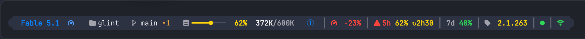
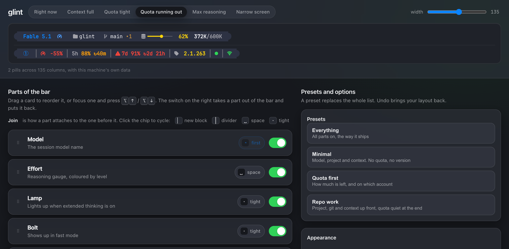

<!-- readme-padrao:header -->
<!-- Banner -->
<div align="center">
  
</div>

<!-- Typing -->
<div align="center">
  
</div>

<div align="center">

  <br>
  
  <br><br>

  <p><strong>One rounded pill on your terminal's dark background: model, effort, context pressure, git state, which Claude account you are on and how much of it is left, version freshness and Claude's own status, at a glance.</strong></p>

  <p>
    <a href="LICENSE"></a>
    <a href="https://docs.claude.com/en/docs/claude-code"></a>
    
    <a href="https://github.com/leonardocandiani/glint/pulls"></a>
  </p>

  <p>
    <a href="#features">Features</a> •
    <a href="#preview-anatomy">Preview / Anatomy</a> •
    <a href="#install">Install</a> •
    <a href="#the-panel">The panel</a> •
    <a href="#configuration">Configuration</a> •
    <a href="#how-it-works">How it works</a> •
    <a href="#requirements">Requirements</a> •
    <a href="#customization">Customization</a> •
    <a href="#license">License</a>
  </p>
</div>

<br>

> **glint** replaces the default Claude Code status line with a single glass pill: bright rim, dark body, the model name read straight from the session, an effort color, a context bar that can track auto-compaction, and your branch with a dirty counter.

> Not affiliated with or endorsed by Anthropic. "Claude" and "Claude Code" are Anthropic trademarks.

## What it is

```yaml
product:  status line for the Claude Code CLI
shows:    model · effort · thinking lamp · project · branch + dirty count · context bar and %
          · which account · quota pace · 5h and 7d windows · version · API status · network
edit:     a local panel picks the parts, their order and how each one joins the previous
look:     Powerline caps, per-character RGB gradient, responsive stacking on narrow terminals
context:  tracks CLAUDE_CODE_AUTO_COMPACT_WINDOW when set, model ceiling otherwise
speed:    one jq pass, one git pass, ~20ms per draw
install:  curl -fsSL .../install.sh | zsh (backs up what it replaces)
requires: zsh, jq, a Nerd Font with Powerline glyphs
license:  MIT
```

<!-- /readme-padrao:header -->

## Features

- 🪟 **Liquid-glass pill** with rounded Powerline caps and a per-character RGB gradient: bright rim light at the edges easing into a darker, cool-tinted body. No banding, no zone seams.
- 🎛️ **A local panel to shape the bar**: `python3 ~/.claude/glint-panel/server.py` opens a page where you switch parts on and off, drag them into the order you want (or move them with <kbd>⌥</kbd><kbd>↑</kbd>/<kbd>⌥</kbd><kbd>↓</kbd>), and choose how each one attaches to the previous. The preview is the real script running with your draft config, with scenarios for a full context window, a quota about to run out or a narrow terminal. Undo and redo cover everything, presets cover the usual shapes, and the result is a plain JSON file you can export, import or edit by hand. Nothing leaves the machine: loopback only, standard library only. See [The panel](#the-panel).
- 🧠 **Future-proof model name** read straight from `model.display_name`. Opus 4.8, 4.9, whatever ships next shows up on its own, no script edits.
- 📊 **Context bar that can track auto-compaction.** Set `CLAUDE_CODE_AUTO_COMPACT_WINDOW` and the bar measures against it, so the percentage shows how close you are to a compaction instead of the distant model ceiling. Falls back to the model's context size otherwise.
- 🎚️ **Thin slider bar** with a round knob marking the fill point. State color shifts with pressure: green under 50%, yellow at 50%, orange at 75%, red at 90%.
- 🎨 **Effort as a speedometer, no word**: the same three-level Nerd Font gauge used for the account pace, needle low for `low`, middle for `medium`, at the end from `high` up, in the level's colour: low gold, medium green, high blue, xhigh purple, max magenta, ultra (ultracode) electric cyan.
- 💡 **Thinking lamp** (gold) when extended thinking is on, plus a **bolt** when fast mode is active.
- 🌿 **Git and worktree aware**: branch name, a dirty counter for uncommitted changes, and the worktree name when you're inside one.
- 📐 **Responsive by design**: it measures the terminal width and, when the content won't fit on one line, splits into multiple complete rounded pills stacked on separate lines, never cutting a segment in half or losing a cap. On a tight terminal the effort label, the token count, and the bar shorten gracefully before anything overflows. Holds down to ~20 columns.
- 🔗 **Optional clickable links** (OSC 8): click the branch to open the repo on GitHub, click the project to open its folder in your file manager. On by default; terminals without hyperlink support just ignore the sequence, and Terminal.app is skipped outright. Set `GLINT_NO_LINKS=1` to turn them off.
- 👤 **Account segment**: which Claude account this session is actually using, shown only as `①` (blue) when it is the primary of your policy and `②` (amber) when it is the fallback (the account name stays out of the bar; `claude-account status` has it), plus the account's 5-hour and 7-day usage on its own scale: green under 55%, yellow from 55%, orange from 80%, red from 90%. Above 80% the window shows when it resets (`↻1h12`, `↻2d 4h`). Right after the account name comes a wordless pace study modelled on quota-axi and CodexBar: a Nerd Font speedometer in three levels and a reserve in percentage points, followed by the 5-hour and 7-day windows as the evidence. Both windows get a projection of where they will land at reset from the pace so far (the 5-hour one also blends the last 15 minutes from the account manager's measurement history, so a recent spike moves the needle without making it nervous), and the gauge shows the tighter of the two, because that is the window that runs out first. Green slow gauge with `+27%` means you can push harder and still end with room; yellow medium gauge means you are close to the pace; red fast gauge with `−12%` means the current pace empties a window before it resets, and that window then shows `↻` with its reset time regardless of the level. Whenever the gauge leaves green, the label of the window at risk (`5h` or `7d`) takes the gauge colour in bold, and a warning triangle marks it when it is going to run out, so you know which one without reading a word. Thin `│` dividers separate account, gauge, windows, version and API status inside the segment. A window with less than 15 minutes elapsed has no pace yet and stays out of the study. The numbers prefer the account manager's own measurement (`~/.config/claude-account/measure.json`, refreshed every 5 minutes) when it is under 10 minutes old, because Claude Code only refreshes `rate_limits` after this session gets an API response, so an idle session would show stale usage. Needs [claude-account-manager](https://github.com/ricardo-landim/claude-account-manager)-style profiles in `~/.config/claude-account`; without them the segment simply shows nothing about accounts.
- 🏷️ **Version with freshness color**: the running Claude Code version, quiet grey when it is the latest on npm, yellow one patch behind, red a minor or major behind, so colour only shows up when there is something to update. Click it to open the GitHub release (the latest one when you are behind). The npm check runs in the background and is cached for 30 minutes; the status line never waits for the network.
- 🟢 **Claude status dot** from [status.claude.com](https://status.claude.com): green when everything is operational, yellow / orange / red following the incident indicator, and the affected components spelled out (`● API,Code`) when something is degraded. Click it to open the status page. Cached for 5 minutes, refreshed in the background.
- 📶 **Network health** right next to it: a wifi glyph coloured by a lightweight HEAD request to the Anthropic API, green up to 300 ms, yellow up to 1 s, orange above that and red when nothing answers. Wired or wireless makes no difference; the question it answers is whether this machine reaches the API well right now. Measured in the background every 60 seconds.
- 🔤 **ASCII mode** (`GLINT_ASCII=1`) for fonts without Nerd Font glyphs: straight pill, no icons, plain markers.
- ⚡ **Built for speed**: one `jq` pass, one `git` pass. Around 20ms per draw (about 80ms with the account segment, which also reads two small cache files).

## Preview / Anatomy

On a wide terminal the whole status line is a single pill; when it doesn't fit, it breaks into stacked pills (see [Responsive line breaking](#how-it-works)). Reading left to right:

```
   Opus 4.8  󰓅 💡    my-project    main •3    ━━━━●───  62%  124K/200K   ①  │ 󰓅  −12% │  5h 84% ↻1h12 │ ⚠7d 91% ↻2d 4h │   2.1.263 │ ● │ 󰖩
   └─ model  └─ effort gauge, thinking lamp   └─ project   └─ branch + dirty   └─ context: bar, %, tokens
                                                       account ─┘   pace ─┘   5h and 7d windows ─┘   version ─┘  status ─┘  network ─┘
```

Thin `│` dividers separate account, pace, windows, version, status and network, so the right half reads as a set of small facts rather than one run-on line.

| Part | What it shows | Detail |
| --- | --- | --- |
| **Rounded caps** | The pill's left and right ends | Powerline glyphs `U+E0B6` / `U+E0B4`, tinted to match the bright edge of the gradient so the pill reads as one coherent surface |
| **Model** | `Opus 4.8`, `Sonnet 4.6`, etc. | From `model.display_name`, with a parse of `model.id` as fallback. Rendered in Apple blue, the single accent color |
| **Account** | `①` or `②` | The account this session runs on, resolved from `CLAUDE_CODE_OAUTH_TOKEN` (matched to your `claude-account` profiles by SHA-256 fingerprint, cached) or the native login otherwise. `①` in blue means the primary of `~/.config/claude-account/policy.json`, `②` in amber means the fallback. The profile name stays out of the bar; `claude-account status` has it |
| **Pace** | gauge + `−12%` | A wordless pace study: the speedometer reads slow, medium or fast for how the quota is being spent, and the number is the reserve, how much of the window you end up with (or over) at the current pace. Green means room to push, red means the window empties before it resets |
| **Limits** | `5h 84% ↻1h12  ⚠7d 91% ↻2d 4h` | The account's 5-hour and 7-day usage: green under 55%, yellow from 55%, orange from 80%, red from 90%. From 80% up, `↻` shows the time until that window resets. When the gauge leaves green, the window at risk takes the gauge colour in bold, with a `⚠` when it is going to run out |
| **Network** | wifi glyph | A light HEAD request to the Anthropic API, coloured by latency: green up to 300 ms, yellow up to 1 s, orange above, red when nothing answers |
| **Version** | `2.1.263` | Claude Code's own version from the payload. Green = latest on npm, yellow = a patch behind, red = a minor or major behind. Clickable: opens the GitHub release |
| **Status** | `●` or `● API,Code` | status.claude.com indicator. Green when all systems are operational; otherwise the incident color plus the affected components. Clickable: opens the status page |
| **Effort** | gauge needle low / middle / end | One glyph, coloured by level (gold, green, blue, purple, magenta, cyan), so you read your reasoning budget without a word. `ultra` is ultracode |
| **Thinking lamp** | 💡 glyph | Shown in gold only when thinking is enabled |
| **Fast bolt** | bolt glyph | Shown when fast mode is on |
| **Project** | Folder, worktree root, or session name | Falls back to the current directory's basename |
| **Git** | Branch (or worktree name) + dirty count | A `•N` amber counter appears when there are uncommitted changes |
| **Context bar** | Slider with a knob | `U+2501` filled track, `U+2500` rail, `U+25CF` knob, all in the current state color |
| **Context %** | Percent of the context budget used | Auto-compact window if you set one, otherwise the model's context size. Bold, in the state color, with the exact used/total token count right after |

## Install

One-liner:

```sh
curl -fsSL https://raw.githubusercontent.com/leonardocandiani/glint/main/install.sh | zsh
```

The installer copies the script into `~/.claude/`, backs up anything it replaces, and wires up `statusLine` in your `settings.json`. It does not touch any of your other settings.

### Manual steps

1. Copy `statusline-command.sh` into your Claude Code config directory:

   ```sh
   cp statusline-command.sh ~/.claude/statusline-command.sh
   chmod +x ~/.claude/statusline-command.sh
   ```

2. Point `statusLine` at it in `~/.claude/settings.json`:

   ```json
   {
     "statusLine": {
       "type": "command",
       "command": "~/.claude/statusline-command.sh"
     }
   }
   ```

3. Restart Claude Code (or start a new session). The pill shows up at the bottom.

That's it. By default the context bar measures against the model's reported context size. If you'd rather it track how close you are to an auto-compaction, opt in (see Configuration).

## The panel

Everything the bar can show is a part, and the panel is where you decide which
parts show up, in which order, and how each one attaches to the one before it.
It is a small local page: no build step, no dependency beyond python3, and the
socket only listens on `127.0.0.1`.

```sh
python3 ~/.claude/glint-panel/server.py
```

<div align="center">
  
</div>

It opens in your browser and writes to `~/.config/glint/config.json`, backing up
the previous version every time you save. Delete that file and the bar goes back
to the default layout, which is the one it has always had.

<b>The preview is the real thing.</b> Every change re-runs `statusline-command.sh`
with your draft config and renders the ANSI it printed, so what you see in the
page is what the terminal will draw. Only the payload is synthetic, which is how
you can look at a full context window or a quota about to run out without waiting
for one to happen: pick a scenario at the top, or drag the width slider to watch
the pill break into stacked pills.

<b>One switch, one list.</b> Every part is a card. The switch on the right takes
it out of the bar, and the card drops to `Out of the bar` at the bottom of the
same list, where the same switch brings it back. Nothing is hidden in a second
place with a different control.

<b>Reorder by drag or by keyboard.</b> The card follows the pointer one to one,
the list opens the gap during the gesture rather than after it, and you can grab
a card again mid-flight; it keeps the velocity it had. Or focus a card and press
<kbd>⌥</kbd><kbd>↑</kbd> / <kbd>⌥</kbd><kbd>↓</kbd>.

<b>Every change is reversible.</b> Undo and redo cover everything, including
applying a preset or importing a file: <kbd>⌘Z</kbd>, <kbd>⇧⌘Z</kbd>, or the
buttons in the bar at the bottom. `Discard` drops everything since the last save,
`Save` (<kbd>⌘S</kbd>) writes the file. A dot in that bar is amber while there is
something unsaved and green when the file matches what you see.

<b>Join, in one line.</b> Each card carries how it attaches to the one before
it, and clicking the chip cycles through the four: `▏new block` (may move to
another pill), `│divider`, `␣space`, `·tight`. The first card has nothing to
attach to, so it says `first` and stays out of the way.

Presets cover the usual shapes (everything, minimal, quota first, repo work),
and export/import moves the JSON between machines.

The config file is plain JSON and hand-editable if you would rather skip the
page:

```json
{
  "version": 1,
  "parts": [
    { "id": "model", "on": true, "join": "block" },
    { "id": "context", "on": true, "join": "block", "opts": { "bar": 8, "tokens": true } },
    { "id": "version", "on": false, "join": "pipe" }
  ],
  "theme": { "flat": false, "links": true, "ascii": false }
}
```

`statusline-command.sh --parts` lists every part id with what it draws, and
`--default-config` prints the factory layout.

## Configuration

Tuning lives in two places: one env var for behavior, and a handful of constants at the top of the script for looks.

| What | Where | Default | Notes |
| --- | --- | --- | --- |
| `CLAUDE_CODE_AUTO_COMPACT_WINDOW` | `env` in `settings.json` (or shell) | unset → model context size | **Opt-in.** The token window the bar measures against. Set it to your real auto-compact threshold to see how close you are to a compaction. Heads up: this is a genuine Claude Code setting that also controls when auto-compact actually fires, not just this display, so only set it if you want that behavior |
| `refreshInterval` | `statusLine` block in `settings.json` | unset | Re-runs the script every N seconds (minimum `1`) on top of the event-driven updates. Set it so the pill re-flows shortly after you resize the terminal, since a resize isn't an update trigger on its own |
| `GLINT_NO_LINKS` | `env` or shell | unset | Set to `1` to disable the OSC 8 clickable links and render everything as plain text |
| `GLINT_ASCII` | `env` or shell | unset | Set to `1` for fonts without Nerd Font glyphs: straight pill, no icons, `1º`/`2º` and `v` as plain text |
| `~/.config/claude-account/` | files | absent | Profiles and `policy.json` from claude-account-manager. When present, the account segment shows which profile the session uses and whether it is the policy's primary or fallback |
| `~/.claude/.cache/claude-latest-version` | cache file | auto | Latest npm version, refreshed in the background every 30 minutes. Delete it to force a refresh |
| `~/.claude/.cache/claude-status` | cache file | auto | status.claude.com indicator and degraded components, refreshed every 5 minutes |
| `GLINT_FLAT_BG` | `env` or shell | unset | Set to `1` to draw the pill on a single solid background instead of the gradient. Use it when Claude Code's own color-depth detection downgrades the status line to 256 colors in your terminal (see [claude-code#59737](https://github.com/anthropics/claude-code/issues/59737)), which quantizes the gradient into blotchy bands. Automatic outside the truecolor allowlist (Ghostty, iTerm2, WezTerm, kitty, Alacritty, VS Code), so you rarely need to set it |
| `GLINT_FORCE_GRADIENT` | `env` or shell | unset | Set to `1` to force the full gradient on a terminal outside the allowlist. Useful to test a new terminal or re-test after a Claude Code update |
| `EDGE_PEAK` | top of `statusline-command.sh` | `680` | How much the pill's edges brighten, on a `0..1000` scale. Higher means a stronger rim light; the center always sits at the base color |
| `GLASS_BR` / `GLASS_BG` / `GLASS_BB` | top of script | `50 / 50 / 58` | RGB of the glass body (the dark center) |
| `GLASS_SR` / `GLASS_SG` / `GLASS_SB` | top of script | `96 / 100 / 118` | RGB of the lit edges (the cool blue-gray rim) |
| State colors | `STATE` block in script | green / yellow / orange / red | The context thresholds and their colors. Edit the RGB triples to retint the bar |
| `C_ACCENT` | palette block | Apple blue | The model accent color |
| Effort colors | `case "$effort"` block | gold / green / blue / purple / magenta / cyan | One color per effort level |
| Caps | `CAP_L` / `CAP_R` | `U+E0B6` / `U+E0B4` | Swap to empty strings if your font lacks the Powerline extras |

## How it works

**Char-by-char gradient.** Instead of coloring fixed zones, the script breaks the rendered line into cells (one foreground color and one character each), then rebuilds it cell by cell with a background color interpolated along a continuous light curve. The curve peaks at both ends (rim light, where glass catches light) and dips in the middle (the translucent body), with a cool blue tint throughout. Because it's continuous, there are no dark "islands" between segments, the pill looks like one molded surface. This depends on counting code points rather than bytes, so the script forces `LANG`/`LC_ALL` to UTF-8 and enables `setopt multibyte` up top.

**Context vs auto-compact.** In a long session the number that matters often isn't how far you are from the model's full context limit, it's how close you are to the next auto-compaction. The script sums input, output, cache-creation, and cache-read tokens, then divides by `CLAUDE_CODE_AUTO_COMPACT_WINDOW` when you've set one (falling back to the model's reported context size otherwise). The bar fills and the color escalates as you approach the limit.

**`model.display_name`.** The model label comes from the payload's `model.display_name`, which Claude Code already formats and versions for you. New model versions appear automatically. If that field is ever empty, the script parses `model.id` as a fallback.

**Responsive line breaking.** The script reads the terminal width from `COLUMNS` (falling back to `tput cols`), then groups the content into atomic blocks: identity, project, git, context. It packs blocks greedily into pills, so a wide terminal stays a single pill, and when the next block won't fit the script opens another complete, capped pill on the line below rather than letting the terminal truncate the row. Long branch and project names are trimmed with an ellipsis, and on very tight widths the context block drops its token count and shortens its bar so a single block never overflows. Because OSC 8 hyperlinks and the rounded caps carry no display width, the width measurement stays exact.

**Clickable links.** When enabled, the branch is wrapped in an OSC 8 hyperlink to the repo on GitHub, parsed from the `origin` remote, and the project name links to its folder through a `file://` URL. The escape is emitted once per block, wrapping the cells, so it never repeats per character or disturbs the gradient. Terminals that don't support OSC 8 ignore it; Terminal.app is skipped outright.

**Account, version and status without waiting.** The account segment never touches the network: it reads `rate_limits` from the payload and resolves the profile name locally (token fingerprint against the Keychain, cached after the first hit, so the Keychain is not opened every second). The version and status checks do need the network, so they run detached in the background (`&!`) with a lock file and write a small cache; each draw only reads the cache, which is why a stale value can show for up to 30 minutes (version) or 5 minutes (status). Clicks are OSC 8 links wrapped around each of those segments, like the branch and project links.

**Solid-background fallback.** The gradient leans on dozens of subtly different truecolor backgrounds per row, so it only survives if every link in the chain keeps 24-bit color. The script's output is parsed and re-rendered by Claude Code itself, and Claude Code picks a color depth per terminal: when it doesn't recognize the terminal it can downgrade the whole status line to 256 colors even with `COLORTERM=truecolor` set (see [claude-code#59737](https://github.com/anthropics/claude-code/issues/59737); the same mechanism hits `foot` and tmux users). Quantized to 256 colors, thirty close gray-blue tones collapse into three or four palette entries and the glass turns into blotchy bands. `GLINT_FLAT_BG=1` sidesteps this with one solid background (the glass center color, caps included), which survives any quantization. The gradient is only enabled on terminals where Claude Code is known to keep truecolor (Ghostty, iTerm2, WezTerm, kitty, Alacritty, VS Code); everywhere else (Zentty, Orca, tmux, Terminal.app, anything unknown) the solid background is automatic. Set `GLINT_FORCE_GRADIENT=1` to override the allowlist and test a new terminal.

## Requirements

- **zsh** (the script is written in zsh and uses zsh-specific features)
- **jq** for the single JSON parse
- A **Nerd Font** in your terminal, for the pill caps and the glyphs
- A terminal with **24-bit truecolor** support, for the gradient

## Customization

Every visual knob lives in clearly labeled constants at the top of `statusline-command.sh`:

- **Make the pill brighter or flatter**: raise or lower `EDGE_PEAK`.
- **Change the glass tone**: edit the `GLASS_B*` (center) and `GLASS_S*` (edge) RGB triples. Push them warmer, cooler, lighter, darker.
- **Retint the context states**: edit the RGB in the `STATE` block, or move the `90` / `75` / `50` thresholds.
- **Recolor effort or the accent**: edit the effort `case` block and `C_ACCENT`.
- **Drop the rounded caps**: if your font doesn't carry the Powerline extras, set `CAP_L` and `CAP_R` to empty strings and the pill becomes a clean rectangle.
- **Resize the bar**: change `bar_total` to widen or narrow the slider.

## Credits

Built by **Leonardo Candiani** ([@leonardocandiani](https://github.com/leonardocandiani)).

## License

[MIT](LICENSE) © Leonardo Candiani

<!-- readme-padrao:footer -->
<br>

---

<div align="center">
  <p><strong>Built by <a href="https://github.com/leonardocandiani">Leonardo Candiani</a></strong> · More projects at <a href="https://github.com/leonardocandiani?tab=repositories">github.com/leonardocandiani</a></p>
  <p>Leonardo Candiani builds AI agents that talk, decide and close deals. Cofounder of SixQuasar, operating Proteauto, SegSmart and IACall end to end.</p>
  <a href="https://leonardocandiani.com.br">
    
  </a>
  <a href="https://github.com/leonardocandiani">
    
  </a>
  <a href="https://instagram.com/leonardocandiani">
    
  </a>
  <a href="https://youtube.com/@oleonardocandiani">
    
  </a>
</div>

<br>

<div align="center">
  
</div>
<!-- /readme-padrao:footer -->
